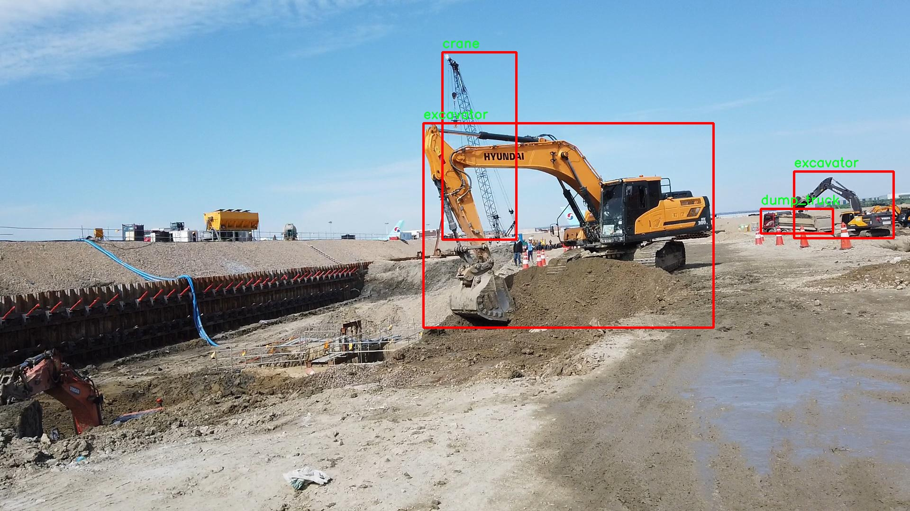

# 改进yolo11-repvit等200+全套创新点大全：工地工程车辆装置检测系统源码＆数据集全套

### 1.图片效果展示


##### 项目来源 **[人工智能促进会 2024.10.22](https://kdocs.cn/l/cszuIiCKVNis)**

##### 注意：由于项目一直在更新迭代，上面“1.图片效果展示”和“2.视频效果展示”展示的系统图片或者视频可能为老版本，新版本在老版本的基础上升级如下：（实际效果以升级的新版本为准）

  （1）适配了YOLOV11的“目标检测”模型和“实例分割”模型，通过加载相应的权重（.pt）文件即可自适应加载模型。

  （2）支持“图片识别”、“视频识别”、“摄像头实时识别”三种识别模式。

  （3）支持“图片识别”、“视频识别”、“摄像头实时识别”三种识别结果保存导出，解决手动导出（容易卡顿出现爆内存）存在的问题，识别完自动保存结果并导出到tempDir中。

  （4）支持Web前端系统中的标题、背景图等自定义修改。

  另外本项目提供训练的数据集和训练教程,暂不提供权重文件（best.pt）,需要您按照教程进行训练后实现图片演示和Web前端界面演示的效果。

### 2.视频效果展示

[2.1 视频效果展示](https://www.bilibili.com/video/BV1uryHYhE3N/)

### 3.背景

研究背景与意义

随着城市化进程的加快，建筑工地的数量不断增加，工程车辆的种类和数量也随之激增。这些车辆在施工过程中承担着重要的运输和作业任务，但同时也带来了安全隐患和管理挑战。传统的人工监控和管理方式已无法满足现代工地对高效、安全管理的需求。因此，开发一种智能化的工地工程车辆检测系统显得尤为重要。基于深度学习的目标检测技术，尤其是YOLO（You Only Look Once）系列模型，因其高效的实时检测能力而受到广泛关注。

本研究旨在基于改进的YOLOv11模型，构建一个高效的工地工程车辆装置检测系统。我们使用的数据集包含3900张图像，涵盖了五类工程车辆：钻孔机、混凝土车、起重机、自卸车和挖掘机。这些车辆在工地上扮演着不同的角色，准确识别和定位它们对于提升工地管理效率、保障施工安全具有重要意义。通过对数据集的深入分析和模型的优化，我们期望能够提高车辆检测的准确率和实时性，从而为工地管理提供更为可靠的技术支持。

此外，随着人工智能技术的不断发展，基于深度学习的目标检测系统在各个领域的应用逐渐增多。本研究不仅具有实际的应用价值，还将为相关领域的研究提供参考和借鉴。通过对YOLOv11模型的改进，我们希望能够推动目标检测技术在工程管理中的应用，进而提升工地的智能化水平，助力建设安全、高效的施工环境。

### 4.数据集信息展示

##### 4.1 本项目数据集详细数据（类别数＆类别名）

nc: 5
names: ['boring_machine', 'concrete_truck', 'crane', 'dump_truck', 'excavator']


该项目为【目标检测】数据集，请在【训练教程和Web端加载模型教程（第三步）】这一步的时候按照【目标检测】部分的教程来训练

##### 4.2 本项目数据集信息介绍

本项目数据集信息介绍

本项目所使用的数据集名为“ai-hub2”，其主要目的是为改进YOLOv11的工地工程车辆装置检测系统提供高质量的训练数据。该数据集包含五个类别，分别是：钻孔机（boring_machine）、混凝土车（concrete_truck）、起重机（crane）、自卸车（dump_truck）和挖掘机（excavator）。这些类别涵盖了工地上常见的重型机械设备，能够有效支持车辆检测系统在复杂环境中的应用。

“ai-hub2”数据集的构建经过精心设计，确保了数据的多样性和代表性。每个类别的样本均来自不同的工地场景，包含了多种视角、光照条件和背景环境。这种多样性使得模型在训练过程中能够学习到更为丰富的特征，从而提高其在实际应用中的泛化能力。此外，数据集中还包含了标注信息，确保每个图像中的目标物体均被准确标识，便于模型进行有效的学习和优化。

在数据集的采集过程中，特别关注了不同工地环境下的车辆状态，包括静态和动态场景。这种设计使得训练后的模型能够在实际工地中快速适应各种情况，提高了检测的准确性和实时性。通过对“ai-hub2”数据集的深入分析与应用，我们期望能显著提升YOLOv11在工地工程车辆装置检测方面的性能，为后续的智能监控和安全管理提供强有力的技术支持。整体而言，本项目的数据集不仅为模型训练提供了坚实的基础，也为未来的研究和应用奠定了良好的数据支持。




### 5.全套项目环境部署视频教程（零基础手把手教学）

[5.1 所需软件PyCharm和Anaconda安装教程（第一步）](https://www.bilibili.com/video/BV1BoC1YCEKi/?spm_id_from=333.999.0.0&vd_source=bc9aec86d164b67a7004b996143742dc)


[5.2 安装Python虚拟环境创建和依赖库安装视频教程（第二步）](https://www.bilibili.com/video/BV1ZoC1YCEBw?spm_id_from=333.788.videopod.sections&vd_source=bc9aec86d164b67a7004b996143742dc)

### 6.改进YOLOv11训练教程和Web_UI前端加载模型教程（零基础手把手教学）

[6.1 改进YOLOv11训练教程和Web_UI前端加载模型教程（第三步）](https://www.bilibili.com/video/BV1BoC1YCEhR?spm_id_from=333.788.videopod.sections&vd_source=bc9aec86d164b67a7004b996143742dc)


按照上面的训练视频教程链接加载项目提供的数据集，运行train.py即可开始训练



     Epoch   gpu_mem       box       obj       cls    labels  img_size
     1/200     20.8G   0.01576   0.01955  0.007536        22      1280: 100%|██████████| 849/849 [14:42<00:00,  1.04s/it]
               Class     Images     Labels          P          R     mAP@.5 mAP@.5:.95: 100%|██████████| 213/213 [01:14<00:00,  2.87it/s]
                 all       3395      17314      0.994      0.957      0.0957      0.0843

     Epoch   gpu_mem       box       obj       cls    labels  img_size
     2/200     20.8G   0.01578   0.01923  0.007006        22      1280: 100%|██████████| 849/849 [14:44<00:00,  1.04s/it]
               Class     Images     Labels          P          R     mAP@.5 mAP@.5:.95: 100%|██████████| 213/213 [01:12<00:00,  2.95it/s]
                 all       3395      17314      0.996      0.956      0.0957      0.0845

     Epoch   gpu_mem       box       obj       cls    labels  img_size
     3/200     20.8G   0.01561    0.0191  0.006895        27      1280: 100%|██████████| 849/849 [10:56<00:00,  1.29it/s]
               Class     Images     Labels          P          R     mAP@.5 mAP@.5:.95: 100%|███████   | 187/213 [00:52<00:00,  4.04it/s]
                 all       3395      17314      0.996      0.957      0.0957      0.0845


###### [项目数据集下载链接](https://kdocs.cn/l/cszuIiCKVNis)

### 7.原始YOLOv11算法讲解

##### YOLO11简介

> YOLO11源码地址：https://github.com/ultralytics/ultralytics

Ultralytics
YOLO11是一款尖端的、最先进的模型，它在之前YOLO版本成功的基础上进行了构建，并引入了新功能和改进，以进一步提升性能和灵活性。YOLO11设计快速、准确且易于使用，使其成为各种物体检测和跟踪、实例分割、图像分类以及姿态估计任务的绝佳选择。  


**YOLO11创新点如下:**

YOLO 11主要改进包括：  
`增强的特征提取`：YOLO 11采用了改进的骨干和颈部架构，增强了特征提取功能，以实现更精确的目标检测。  
`优化的效率和速度`：优化的架构设计和优化的训练管道提供更快的处理速度，同时保持准确性和性能之间的平衡。  
`更高的精度，更少的参数`：YOLO11m在COCO数据集上实现了更高的平均精度（mAP），参数比YOLOv8m少22%，使其在不影响精度的情况下提高了计算效率。  
`跨环境的适应性`：YOLO 11可以部署在各种环境中，包括边缘设备、云平台和支持NVIDIA GPU的系统。  
`广泛的支持任务`：YOLO 11支持各种计算机视觉任务，如对象检测、实例分割、图像分类、姿态估计和面向对象检测（OBB）。

**YOLO11不同模型尺寸信息：**

YOLO11 提供5种不同的型号规模模型，以满足不同的应用需求：

Model| size (pixels)| mAPval 50-95| Speed CPU ONNX (ms)| Speed T4 TensorRT10
(ms)| params (M)| FLOPs (B)  
---|---|---|---|---|---|---  
YOLO11n| 640| 39.5| 56.1 ± 0.8| 1.5 ± 0.0| 2.6| 6.5  
YOLO11s| 640| 47.0| 90.0 ± 1.2| 2.5 ± 0.0| 9.4| 21.5  
YOLO11m| 640| 51.5| 183.2 ± 2.0| 4.7 ± 0.1| 20.1| 68.0  
YOLO11l| 640| 53.4| 238.6 ± 1.4| 6.2 ± 0.1| 25.3| 86.9  
YOLO11x| 640| 54.7| 462.8 ± 6.7| 11.3 ± 0.2| 56.9| 194.9  
  
**模型常用训练超参数参数说明：**  
`YOLOv11
模型的训练设置包括训练过程中使用的各种超参数和配置`。这些设置会影响模型的性能、速度和准确性。关键的训练设置包括批量大小、学习率、动量和权重衰减。此外，优化器、损失函数和训练数据集组成的选择也会影响训练过程。对这些设置进行仔细的调整和实验对于优化性能至关重要。  
**以下是一些常用的模型训练参数和说明：**

参数名| 默认值| 说明  
---|---|---  
`model`| `None`| 指定用于训练的模型文件。接受指向 `.pt` 预训练模型或 `.yaml`
配置文件。对于定义模型结构或初始化权重至关重要。  
`data`| `None`| 数据集配置文件的路径（例如
`coco8.yaml`).该文件包含特定于数据集的参数，包括训练数据和验证数据的路径、类名和类数。  
`epochs`| `100`| 训练总轮数。每个epoch代表对整个数据集进行一次完整的训练。调整该值会影响训练时间和模型性能。  
`patience`| `100`| 在验证指标没有改善的情况下，提前停止训练所需的epoch数。当性能趋于平稳时停止训练，有助于防止过度拟合。  
`batch`| `16`| 批量大小，有三种模式:设置为整数(例如，’ Batch =16 ‘)， 60% GPU内存利用率的自动模式(’ Batch
=-1 ‘)，或指定利用率分数的自动模式(’ Batch =0.70 ')。  
`imgsz`| `640`| 用于训练的目标图像尺寸。所有图像在输入模型前都会被调整到这一尺寸。影响模型精度和计算复杂度。  
`device`| `None`| 指定用于训练的计算设备：单个 GPU (`device=0`）、多个 GPU (`device=0,1`)、CPU
(`device=cpu`)，或苹果芯片的 MPS (`device=mps`).  
`workers`| `8`| 加载数据的工作线程数（每 `RANK` 多 GPU 训练）。影响数据预处理和输入模型的速度，尤其适用于多 GPU 设置。  
`name`| `None`| 训练运行的名称。用于在项目文件夹内创建一个子目录，用于存储训练日志和输出结果。  
`pretrained`| `True`| 决定是否从预处理模型开始训练。可以是布尔值，也可以是加载权重的特定模型的字符串路径。提高训练效率和模型性能。  
`optimizer`| `'auto'`| 为训练模型选择优化器。选项包括 `SGD`, `Adam`, `AdamW`, `NAdam`,
`RAdam`, `RMSProp` 等，或 `auto` 用于根据模型配置进行自动选择。影响收敛速度和稳定性  
`lr0`| `0.01`| 初始学习率（即 `SGD=1E-2`, `Adam=1E-3`) .调整这个值对优化过程至关重要，会影响模型权重的更新速度。  
`lrf`| `0.01`| 最终学习率占初始学习率的百分比 = (`lr0 * lrf`)，与调度程序结合使用，随着时间的推移调整学习率。  


**各损失函数作用说明：**  
`定位损失box_loss`：预测框与标定框之间的误差（GIoU），越小定位得越准；  
`分类损失cls_loss`：计算锚框与对应的标定分类是否正确，越小分类得越准；  
`动态特征损失（dfl_loss）`：DFLLoss是一种用于回归预测框与目标框之间距离的损失函数。在计算损失时，目标框需要缩放到特征图尺度，即除以相应的stride，并与预测的边界框计算Ciou
Loss，同时与预测的anchors中心点到各边的距离计算回归DFLLoss。  


### 8.200+种全套改进YOLOV11创新点原理讲解

#### 8.1 200+种全套改进YOLOV11创新点原理讲解大全

由于篇幅限制，每个创新点的具体原理讲解就不全部展开，具体见下列网址中的改进模块对应项目的技术原理博客网址【Blog】（创新点均为模块化搭建，原理适配YOLOv5~YOLOv11等各种版本）

[改进模块技术原理博客【Blog】网址链接](https://gitee.com/qunmasj/good)


#### 8.2 精选部分改进YOLOV11创新点原理讲解

###### 这里节选部分改进创新点展开原理讲解(完整的改进原理见上图和[改进模块技术原理博客链接](https://gitee.com/qunmasj/good)【如果此小节的图加载失败可以通过CSDN或者Github搜索该博客的标题访问原始博客，原始博客图片显示正常】
### 深度学习基础
卷积神经网络通过使用具有共享参数的卷积运算显著降低了模型的计算开销和复杂性。在LeNet、AlexNet和VGG等经典网络的驱动下，卷积神经网络现在已经建立了一个完整的系统，并在深度学习领域形成了先进的卷积神经网络模型。

感受野注意力卷积RFCBAMConv的作者在仔细研究了卷积运算之后获得了灵感。对于分类、目标检测和语义分割任务，一方面，图像中不同位置的对象的形状、大小、颜色和分布是可变的。在卷积操作期间，卷积核在每个感受野中使用相同的参数来提取信息，而不考虑来自不同位置的差分信息。这限制了网络的性能，这已经在最近的许多工作中得到了证实。

另一方面，卷积运算没有考虑每个特征的重要性，这进一步影响了提取特征的有效性，并最终限制了模型的性能。此外，注意力机制允许模型专注于重要特征，这可以增强特征提取的优势和卷积神经网络捕获详细特征信息的能力。因此，注意力机制在深度学习中得到了广泛的应用，并成功地应用于各个领域。

通过研究卷积运算的内在缺陷和注意力机制的特点，作者认为现有的空间注意力机制从本质上解决了卷积运算的参数共享问题，但仍局限于对空间特征的认知。对于较大的卷积核，现有的空间注意力机制并没有完全解决共享参数的问题。此外，他们无法强调感受野中每个特征的重要性，例如现有的卷积块注意力模块（CBAM）和 Coordinate注意力（CA）。

因此，[参考该博客提出了一种新的感受野注意力机制（RFA）](https://qunmasj.com)，它完全解决了卷积核共享参数的问题，并充分考虑了感受野中每个特征的重要性。通过RFA设计的卷积运算（RFAConv）是一种新的卷积运算，可以取代现有神经网络中的标准卷积运算。RFAConv通过添加一些参数和计算开销来提高网络性能。

大量关于Imagnet-1k、MS COCO和VOC的实验已经证明了RFAConv的有效性。作为一种由注意力构建的新型卷积运算，它超过了由CAM、CBAM和CA构建的卷积运算（CAMConv、CBAMConv、CAConv）以及标准卷积运算。

此外，为了解决现有方法提取感受野特征速度慢的问题，提出了一种轻量级操作。在构建RFAConv的过程中，再次设计了CA和CBAM的升级版本，并进行了相关实验。作者认为当前的空间注意力机制应该将注意力放在感受野空间特征上，以促进当前空间注意力机制的发展，并再次增强卷积神经网络架构的优势。


### 卷积神经网络架构
出色的神经网络架构可以提高不同任务的性能。卷积运算作为卷积神经网络的一种基本运算，推动了人工智能的发展，并为车辆检测、无人机图像、医学等先进的网络模型做出了贡献。He等人认为随着网络深度的增加，该模型将变得难以训练并产生退化现象，因此他们提出了残差连接来创新卷积神经网络架构的设计。Huang等人通过重用特征来解决网络梯度消失问题，增强了特征信息，他们再次创新了卷积神经网络架构。

通过对卷积运算的详细研究，Dai等人认为，具有固定采样位置的卷积运算在一定程度上限制了网络的性能，因此提出了Deformable Conv，通过学习偏移来改变卷积核的采样位置。在Deformable Conv的基础上，再次提出了Deformable Conv V2和Deformable Conv V3，以提高卷积网络的性能。

Zhang等人注意到，组卷积可以减少模型的参数数量和计算开销。然而，少于组内信息的交互将影响最终的网络性能。1×1的卷积可以与信息相互作用。然而，这将带来更多的参数和计算开销，因此他们提出了无参数的“通道Shuffle”操作来与组之间的信息交互。

Ma等人通过实验得出结论，对于参数较少的模型，推理速度不一定更快，对于计算量较小的模型，推理也不一定更快。经过仔细研究提出了Shufflenet V2。

YOLO将输入图像划分为网格，以预测对象的位置和类别。经过不断的研究，已经提出了8个版本的基于YOLO的目标检测器，如YOLOv11、YOLOv11、YOLOv11等。上述卷积神经网络架构已经取得了巨大的成功。然而，它们并没有解决提取特征过程中的参数共享问题。本文的工作从注意力机制开始，从一个新的角度解决卷积参数共享问题。

### 注意力机制
注意力机制被用作一种提高网络模型性能的技术，使其能够专注于关键特性。注意力机制理论已经在深度学习中建立了一个完整而成熟的体系。Hu等人提出了一种Squeeze-and-Excitation（SE）块，通过压缩特征来聚合全局通道信息，从而获得与每个通道对应的权重。Wang等人认为，当SE与信息交互时，单个通道和权重之间的对应关系是间接的，因此设计了高效通道注Efficient Channel Attention力（ECA），并用自适应kernel大小的一维卷积取代了SE中的全连接（FC）层。Woo等人提出了卷积块注意力模块（CBAM），它结合了通道注意力和空间注意力。作为一个即插即用模块，它可以嵌入卷积神经网络中，以提高网络性能。

尽管SE和CBAM已经提高了网络的性能。Hou等人仍然发现压缩特征在SE和CBAM中丢失了太多信息。因此，他们提出了轻量级Coordinate注意力（CA）来解决SE和CBAM中的问题。Fu等人计了一个空间注意力模块和通道注意力模块，用于扩展全卷积网络（FCN），分别对空间维度和通道维度的语义相关性进行建模。Zhang等人在通道上生成不同尺度的特征图，以建立更有效的通道注意力机制。

本文从一个新的角度解决了标准卷积运算的参数共享问题。这就是将注意力机制结合起来构造卷积运算。尽管目前的注意力机制已经获得了良好的性能，但它们仍然没有关注感受野的空间特征。因此，设计了具有非共享参数的RFA卷积运算，以提高网络的性能。


#### 回顾标准卷积
以标准卷积运算为基础构建卷积神经网络，通过共享参数的滑动窗口提取特征信息，解决了全连接层构建的神经网络的固有问题（即参数数量大、计算开销高）。

设表示输入特征图，其中、和分别表示特征图的通道数、高度和宽度。为了能够清楚地展示卷积核提取特征信息的过程，以为例。提取每个感受野slider的特征信息的卷积运算可以表示如下：


这里，表示在每次卷积slider操作之后获得的值，表示在每个slider内的相应位置处的像素值。表示卷积核，表示卷积核中的参数数量，表示感受野slider的总数。

可以看出，每个slider内相同位置的特征共享相同的参数。因此，标准的卷积运算无法感知不同位置带来的差异信息，这在一定程度上限制了卷积神经网络的性能。

#### 回顾空间注意力
目前，空间注意力机制使用通过学习获得的注意力图来突出每个特征的重要性。与上一节类似，以为例。突出关键特征的空间注意力机制可以简单地表达如下：


这里，表示在加权运算之后获得的值。和分别表示输入特征图和学习注意力图在不同位置的值，是输入特征图的高度和宽度的乘积，表示像素值的总数。一般来说，整个过程可以简单地表示在图1中。


#### 空间注意力与标准卷积
众所周知，将注意力机制引入卷积神经网络可以提高网络的性能。通过标准的卷积运算和对现有空间注意力机制的仔细分析。作者认为空间注意力机制本质上解决了卷积神经网络的固有缺点，即共享参数的问题。

目前，该模型最常见的卷积核大小为1×1和3×3。引入空间注意力机制后用于提取特征的卷积操作是1×1或3×3卷积操作。这个过程可以直观地显示出来。空间注意力机制被插入到1×1卷积运算的前面。通过注意力图对输入特征图进行加权运算（Re-weight“×”），最后通过1×1卷积运算提取感受野的slider特征信息。

整个过程可以简单地表示如下：


 

这里，卷积核仅表示一个参数值。如果将的值作为一个新的卷积核参数，那么有趣的是，通过1×1卷积运算提取特征时的参数共享问题得到了解决。然而，空间注意力机制的传说到此结束。当空间注意力机制被插入到3×3卷积运算的前面时。具体情况如下：


如上所述，如果取的值。作为一种新的卷积核参数，上述方程完全解决了大规模卷积核的参数共享问题。然而，最重要的一点是，卷积核在每个感受野slider中提取将共享部分特征的特征。换句话说，在每个感受野slider内都会有重叠。

经过仔细分析发现，，…，空间注意力图的权重在每个slider内共享。因此，空间注意机制不能解决大规模卷积核共享参数的问题，因为它们不注意感受野的空间特征。在这种情况下，空间注意力机制是有限的。
#### 创新空间注意力与标准卷积
RFA是为了解决空间注意力机制问题而提出的，创新了空间注意力。使用与RFA相同的思想，一系列空间注意力机制可以再次提高性能。RFA设计的卷积运算可以被视为一种轻量级的即插即用模块，以取代标准卷积，从而提高卷积神经网络的性能。因此，作者认为空间注意力机制和标准卷积在未来将有一个新的春天。

感受野的空间特征：

现在给出感受野空间特征的定义。它是专门为卷积核设计的，并根据kernel大小动态生成，如图2所示，以3×3卷积核为例。


在图2中，“空间特征”表示原始特征图，等于空间特征。“感受野空间特征”表示变换后的特征，该特征由每个感受野slider滑块组成，并且不重叠。也就是说，“感受野空间特征”中的每个3×3大小的slider表示提取原始3×3卷积特征时所有感觉野slider的特征。

#### 感受野注意力卷积(RFA):

关于感受野空间特征，该博客的作者提出了感受野注意（RFA），它不仅强调了感受野slider内各种特征的重要性，而且还关注感受野空间特性，以彻底解决卷积核参数共享的问题。感受野空间特征是根据卷积核的大小动态生成的，因此，RFA是卷积的固定组合，不能脱离卷积运算的帮助，卷积运算同时依赖RFA来提高性能。

因此，作者提出了感受野注意力卷积（RFAConv）。具有3×3大小卷积核的RFAConv的总体结构如图3所示。


目前，提取感受野特征最常用的方法速度较慢，因此经过不断探索提出了一种快速的方法，通过分组卷积来取代原来的方法。

具体来说，根据感受野大小，使用相应的组卷积大小来动态生成展开特征。尽管与原始的无参数方法（如Pytorch提供的nn.Unfld()）相比，该方法添加了一些参数，但速度要快得多。

注意：正如在上一节中提到的，当原始的3×3卷积核提取特征时，感受野空间特征中的每个3×3大小的窗口表示所有感受野滑块的特征。但在快速分组卷积提取感受野特征后，由于原始方法太慢，它们会被映射到新的特征中。

最近的一些工作已经证明信息交互可以提高网络性能。类似地，对于RFAConv，与感受野特征信息交互以学习注意力图可以提高网络性能，但与每个感受野特征交互将带来额外的计算开销。为了确保少量的计算开销和参数数量，通过探索使用AvgPool池化每个感受野特征的全局信息，然后通过1×1组卷积运算与信息交互。最后，softmax用于强调感受野特征中每个特征的重要性。通常，RFA的计算可以表示为：


表示分组卷积，表示卷积核的大小，代表规范化，表示输入特征图，是通过将注意力图与变换的感受野空间特征相乘而获得的。

与CBAM和CA不同，RFA可以为每个感受野特征生成注意力图。标准卷积受到卷积神经网络性能的限制，因为共享参数的卷积运算对位置带来的差异信息不敏感。RFA完全可以解决这个问题，具体细节如下：


由于RFA获得的特征图是“调整形状”后不重叠的感受野空间特征，因此通过池化每个感受野滑块的特征信息来学习学习的注意力图。换句话说，RFA学习的注意力图不再在每个感受野slider内共享，并且是有效的。这完全解决了现有的CA和CBAM对大尺寸kernel的注意力机制中的参数共享问题。

同时，RFA给标准卷积核带来了相当大的好处，但调整形状后，特征的高度和宽度是k倍，需要进行k×k的stride卷积运算，才能提取特征信息。RFAConv创新了标准卷积运算。

此外，空间注意力机制将得到升级，因为作者认为现有的空间注意力机制应该专注于感受野空间特征，以提高网络的性能。众所周知，基于自注意力机制的网络模型取得了巨大的成功，因为它解决了卷积参数共享的问题，并对远程信息进行了建模，但基于自注意力机理的方法给模型带来了巨大的计算开销和复杂性。作者认为通过将一些现有空间注意力机制的注意力放在感受野空间特征中，它以轻量级的方式解决了自注意力机制的问题。

答案如下：

将关注感受野空间特征的空间注意力与卷积相匹配，完全解决了卷积参数共享的问题；

当前的空间注意力机制本身具有考虑远距离信息的特点，它们通过全局平均池化或全局最大池化来获得全局信息，这在一定程度上考虑了远距离信息。


为此，作者设计了一种新的CBAM和CA，称为RFACBAM和RFACA，它专注于感受野的空间特征。与RFA类似，使用stride为k的k×k的最终卷积运算来提取特征信息，具体结构如图4和图5所示，将这2种新的卷积方法称为RFCBAMConv和RFCAConv。比较原始的CBAM，使用SE注意力来代替RFCBAM中的CAM。因为这样可以减少计算开销。


此外，在RFCBAM中，通道和空间注意力不是在单独的步骤中执行的，因为通道和空间注意力是同时加权的，从而允许在每个通道上获得的注意力图是不同的。


### 9.系统功能展示

图9.1.系统支持检测结果表格显示

  图9.2.系统支持置信度和IOU阈值手动调节

  图9.3.系统支持自定义加载权重文件best.pt(需要你通过步骤5中训练获得)

  图9.4.系统支持摄像头实时识别

  图9.5.系统支持图片识别

  图9.6.系统支持视频识别

  图9.7.系统支持识别结果文件自动保存

  图9.8.系统支持Excel导出检测结果数据


### 10. YOLOv11核心改进源码讲解

#### 10.1 FreqFusion.py

以下是对给定代码的核心部分进行提炼和详细注释的结果。主要保留了 `FreqFusion` 类及其相关方法，因为它是实现频率感知特征融合的核心。

```python
import torch
import torch.nn as nn
import torch.nn.functional as F

class FreqFusion(nn.Module):
    def __init__(self,
                 channels,
                 scale_factor=1,
                 lowpass_kernel=5,
                 highpass_kernel=3,
                 encoder_kernel=3,
                 hr_residual=True,
                 use_high_pass=True,
                 use_low_pass=True,
                 **kwargs):
        """
        初始化频率感知特征融合模块。

        参数：
        - channels: 输入特征的通道数，格式为 (高分辨率通道数, 低分辨率通道数)
        - scale_factor: 上采样因子
        - lowpass_kernel: 低通滤波器的核大小
        - highpass_kernel: 高通滤波器的核大小
        - encoder_kernel: 编码器的卷积核大小
        - hr_residual: 是否使用高分辨率残差
        - use_high_pass: 是否使用高通滤波
        - use_low_pass: 是否使用低通滤波
        """
        super().__init__()
        hr_channels, lr_channels = channels
        self.scale_factor = scale_factor
        self.hr_channel_compressor = nn.Conv2d(hr_channels, hr_channels // 8, 1)  # 高分辨率通道压缩
        self.lr_channel_compressor = nn.Conv2d(lr_channels, lr_channels // 8, 1)  # 低分辨率通道压缩
        
        # 低通滤波器生成器
        self.content_encoder = nn.Conv2d(
            hr_channels // 8,
            lowpass_kernel ** 2,
            encoder_kernel,
            padding=encoder_kernel // 2
        )
        
        # 高通滤波器生成器
        if use_high_pass:
            self.content_encoder2 = nn.Conv2d(
                hr_channels // 8,
                highpass_kernel ** 2,
                encoder_kernel,
                padding=encoder_kernel // 2
            )
        
        self.hr_residual = hr_residual
        self.use_high_pass = use_high_pass
        self.use_low_pass = use_low_pass

    def kernel_normalizer(self, mask, kernel):
        """
        对生成的掩码进行归一化处理。

        参数：
        - mask: 输入掩码
        - kernel: 卷积核大小
        """
        mask = F.softmax(mask.view(mask.size(0), -1), dim=1)  # 对掩码进行softmax归一化
        mask = mask.view(mask.size(0), 1, kernel, kernel)  # 重塑为卷积核形状
        return mask

    def forward(self, x):
        """
        前向传播函数。

        参数：
        - x: 输入特征，格式为 (高分辨率特征, 低分辨率特征)

        返回：
        - 融合后的特征
        """
        hr_feat, lr_feat = x  # 拆分输入特征
        
        # 压缩高分辨率和低分辨率特征
        compressed_hr_feat = self.hr_channel_compressor(hr_feat)
        compressed_lr_feat = self.lr_channel_compressor(lr_feat)

        # 生成低通掩码
        mask_lr = self.content_encoder(compressed_hr_feat)
        mask_lr = self.kernel_normalizer(mask_lr, self.lowpass_kernel)

        # 低分辨率特征上采样
        lr_feat = F.interpolate(lr_feat, scale_factor=self.scale_factor, mode='nearest')
        lr_feat = F.conv2d(lr_feat, mask_lr)  # 应用低通掩码

        if self.use_high_pass:
            # 生成高通掩码
            mask_hr = self.content_encoder2(compressed_hr_feat)
            mask_hr = self.kernel_normalizer(mask_hr, self.highpass_kernel)

            # 高分辨率特征残差处理
            hr_feat_hf = hr_feat - F.conv2d(hr_feat, mask_hr)  # 计算高频特征
            hr_feat = hr_feat_hf + hr_feat if self.hr_residual else hr_feat_hf  # 添加残差

        return hr_feat + lr_feat  # 返回融合后的特征
```

### 代码说明
1. **FreqFusion 类**: 这是一个 PyTorch 模块，用于实现频率感知特征融合。它接受高分辨率和低分辨率特征，通过低通和高通滤波器进行处理，最后融合这两种特征。

2. **初始化方法**: 在构造函数中，定义了高分辨率和低分辨率特征的通道压缩层，以及低通和高通滤波器的卷积层。

3. **kernel_normalizer 方法**: 该方法用于对生成的掩码进行归一化处理，确保掩码的和为1，以便在卷积操作中有效应用。

4. **forward 方法**: 这是前向传播的核心逻辑。它将输入的高分辨率和低分辨率特征进行压缩，生成掩码，并根据需要进行上采样和残差处理，最终返回融合后的特征。

通过以上注释和代码重构，可以更清晰地理解频率感知特征融合的实现逻辑。

这个文件`FreqFusion.py`实现了一个名为`FreqFusion`的深度学习模块，主要用于图像预测任务，特别是在密集图像预测中。它结合了频率感知特征融合的技术，旨在提高图像的细节和质量。

首先，文件导入了必要的库，包括PyTorch和一些特定的操作库。接着定义了一些初始化函数，如`normal_init`和`constant_init`，用于初始化神经网络中的权重和偏置。这些函数确保模型在训练开始时具有良好的参数设置。

`resize`函数用于调整输入张量的大小，支持多种插值模式，并在特定条件下发出警告。`hamming2D`函数生成二维Hamming窗，用于后续的频率处理。

`FreqFusion`类是这个模块的核心，继承自`nn.Module`。在初始化方法中，类接收多个参数，如通道数、缩放因子、低通和高通滤波器的核大小等。该类定义了多个卷积层和其他必要的组件，以实现高频和低频特征的提取和融合。

在`init_weights`方法中，使用Xavier初始化和正态初始化对卷积层的权重进行初始化，以确保模型的收敛性和稳定性。

`kernel_normalizer`方法用于对生成的掩码进行归一化处理，以确保它们的总和为1，从而在后续的卷积操作中保持特征的平衡。

`forward`方法是模型的前向传播过程，接收高分辨率和低分辨率的特征图，并通过一系列的卷积和上采样操作进行处理。该方法支持使用检查点技术，以节省内存。

在`_forward`方法中，首先对输入的高分辨率和低分辨率特征进行压缩，然后根据是否使用半卷积和特征重采样的设置，选择不同的路径进行特征融合。通过使用`carafe`操作，模型能够在高频和低频特征之间进行有效的融合。

`LocalSimGuidedSampler`类是用于生成偏移量的模块，它通过计算输入特征的相似性来指导特征的重采样。该类支持多种配置选项，以便在不同的场景下使用。

最后，`compute_similarity`函数用于计算输入张量中每个点与其周围点的余弦相似度，这在特征重采样中起到关键作用。

整体而言，`FreqFusion.py`文件实现了一个复杂的深度学习模型，结合了多种技术来提升图像预测的效果，尤其是在处理细节和特征融合方面表现出色。

#### 10.2 EfficientFormerV2.py

以下是经过简化和注释的核心代码部分，主要保留了模型的结构和功能。

```python
import torch
import torch.nn as nn
import math
import itertools

class Attention4D(nn.Module):
    """4D注意力机制模块"""
    def __init__(self, dim=384, key_dim=32, num_heads=8, attn_ratio=4, resolution=7, act_layer=nn.ReLU, stride=None):
        super().__init__()
        self.num_heads = num_heads  # 注意力头的数量
        self.scale = key_dim ** -0.5  # 缩放因子
        self.key_dim = key_dim  # 键的维度
        self.nh_kd = key_dim * num_heads  # 总的键维度

        # 如果有步幅，则需要进行卷积和上采样
        if stride is not None:
            self.resolution = math.ceil(resolution / stride)  # 计算新的分辨率
            self.stride_conv = nn.Sequential(
                nn.Conv2d(dim, dim, kernel_size=3, stride=stride, padding=1, groups=dim),
                nn.BatchNorm2d(dim),
            )
            self.upsample = nn.Upsample(scale_factor=stride, mode='bilinear')
        else:
            self.resolution = resolution
            self.stride_conv = None
            self.upsample = None

        self.N = self.resolution ** 2  # 总的空间位置数量
        self.d = int(attn_ratio * key_dim)  # 注意力的输出维度
        self.dh = self.d * num_heads  # 总的输出维度

        # 定义查询、键、值的卷积层
        self.q = nn.Sequential(nn.Conv2d(dim, self.num_heads * self.key_dim, 1), nn.BatchNorm2d(self.num_heads * self.key_dim))
        self.k = nn.Sequential(nn.Conv2d(dim, self.num_heads * self.key_dim, 1), nn.BatchNorm2d(self.num_heads * self.key_dim))
        self.v = nn.Sequential(nn.Conv2d(dim, self.num_heads * self.d, 1), nn.BatchNorm2d(self.num_heads * self.d))

        # 局部值的卷积层
        self.v_local = nn.Sequential(
            nn.Conv2d(self.num_heads * self.d, self.num_heads * self.d, kernel_size=3, stride=1, padding=1, groups=self.num_heads * self.d),
            nn.BatchNorm2d(self.num_heads * self.d),
        )

        # 投影层
        self.proj = nn.Sequential(act_layer(), nn.Conv2d(self.dh, dim, 1), nn.BatchNorm2d(dim))

        # 计算注意力偏置
        points = list(itertools.product(range(self.resolution), range(self.resolution)))
        attention_offsets = {}
        idxs = []
        for p1 in points:
            for p2 in points:
                offset = (abs(p1[0] - p2[0]), abs(p1[1] - p2[1]))
                if offset not in attention_offsets:
                    attention_offsets[offset] = len(attention_offsets)
                idxs.append(attention_offsets[offset])
        self.attention_biases = nn.Parameter(torch.zeros(num_heads, len(attention_offsets)))
        self.register_buffer('attention_bias_idxs', torch.LongTensor(idxs).view(self.N, self.N))

    def forward(self, x):
        """前向传播"""
        B, C, H, W = x.shape
        if self.stride_conv is not None:
            x = self.stride_conv(x)  # 应用步幅卷积

        # 计算查询、键、值
        q = self.q(x).flatten(2).reshape(B, self.num_heads, -1, self.N).permute(0, 1, 3, 2)
        k = self.k(x).flatten(2).reshape(B, self.num_heads, -1, self.N).permute(0, 1, 2, 3)
        v = self.v(x)
        v_local = self.v_local(v)
        v = v.flatten(2).reshape(B, self.num_heads, -1, self.N).permute(0, 1, 3, 2)

        # 计算注意力权重
        attn = (q @ k) * self.scale + self.attention_biases[:, self.attention_bias_idxs]
        attn = attn.softmax(dim=-1)  # 应用softmax

        # 计算输出
        x = (attn @ v)
        out = x.transpose(2, 3).reshape(B, self.dh, self.resolution, self.resolution) + v_local
        if self.upsample is not None:
            out = self.upsample(out)

        out = self.proj(out)  # 投影到原始维度
        return out


class EfficientFormerV2(nn.Module):
    """EfficientFormerV2模型"""
    def __init__(self, layers, embed_dims, num_classes=1000):
        super().__init__()
        self.patch_embed = nn.Conv2d(3, embed_dims[0], kernel_size=3, stride=2, padding=1)  # 输入图像的嵌入层
        self.network = nn.ModuleList()  # 存储网络的各个层

        # 构建网络的各个层
        for i in range(len(layers)):
            stage = nn.Sequential(*[Attention4D(dim=embed_dims[i]) for _ in range(layers[i])])  # 添加多个注意力层
            self.network.append(stage)

        self.classifier = nn.Linear(embed_dims[-1], num_classes)  # 分类器

    def forward(self, x):
        """前向传播"""
        x = self.patch_embed(x)  # 嵌入输入图像
        for block in self.network:
            x = block(x)  # 通过网络的每一层
        x = x.mean(dim=[2, 3])  # 全局平均池化
        x = self.classifier(x)  # 分类
        return x


# 创建模型实例
def efficientformerv2_s0():
    model = EfficientFormerV2(layers=[2, 2, 6, 4], embed_dims=[32, 48, 96, 176])  # 定义模型的层数和嵌入维度
    return model

# 测试模型
if __name__ == '__main__':
    inputs = torch.randn((1, 3, 640, 640))  # 随机输入
    model = efficientformerv2_s0()  # 创建模型
    res = model(inputs)  # 前向传播
    print(res.size())  # 输出结果的尺寸
```

### 代码注释说明：
1. **Attention4D类**：实现了一个4D注意力机制，主要用于处理输入的特征图。包含了查询、键、值的计算和注意力权重的生成。
2. **EfficientFormerV2类**：定义了整个模型的结构，包括输入的嵌入层和多个注意力层的堆叠，最后通过分类器输出结果。
3. **forward方法**：实现了模型的前向传播逻辑，输入经过嵌入层、多个注意力层和分类器，最终输出分类结果。
4. **efficientformerv2_s0函数**：用于创建一个特定配置的EfficientFormerV2模型实例。
5. **主程序部分**：用于测试模型的创建和前向传播，输出结果的尺寸。

这个程序文件定义了一个名为 `EfficientFormerV2` 的深度学习模型，主要用于图像处理任务。它使用了高效的变换器架构，结合了卷积和自注意力机制，以提高模型的性能和效率。

首先，文件中导入了一些必要的库，包括 PyTorch 和其他辅助模块。接着，定义了一些与模型结构相关的参数，例如不同版本的模型宽度和深度（`EfficientFormer_width` 和 `EfficientFormer_depth`），以及扩展比率（`expansion_ratios_L` 等）。这些参数用于构建不同规模的 EfficientFormerV2 模型。

接下来，定义了多个类来实现模型的各个组件。`Attention4D` 类实现了四维注意力机制，支持输入图像的多头自注意力计算。它的构造函数中设置了输入维度、关键维度、头数等参数，并定义了查询、键、值的卷积层。`forward` 方法实现了前向传播，计算注意力权重并生成输出。

`stem` 函数用于构建模型的初始卷积层，接着定义了 `LGQuery` 和 `Attention4DDownsample` 类，这些类分别实现了局部查询和下采样的注意力机制。

`Embedding` 类用于将输入图像嵌入到更高维度的特征空间，支持不同的嵌入方式，包括轻量级嵌入和自注意力嵌入。

`Mlp` 和 `AttnFFN` 类实现了多层感知机和带注意力的前馈网络，分别用于特征的非线性变换和信息的混合。

`eformer_block` 函数用于构建 EfficientFormer 的每个块，根据给定的层数和参数创建不同的网络层。

`EfficientFormerV2` 类是模型的核心，负责组合所有的网络层和模块。它的构造函数中接收了多个参数，包括层数、嵌入维度、丢弃率等，并构建了完整的网络结构。`forward` 方法实现了模型的前向传播。

最后，定义了一些辅助函数，如 `update_weight` 用于更新模型权重，以及 `efficientformerv2_s0`、`efficientformerv2_s1`、`efficientformerv2_s2` 和 `efficientformerv2_l` 函数，用于创建不同规模的 EfficientFormerV2 模型并加载预训练权重。

在文件的最后部分，提供了一个测试示例，生成随机输入并通过不同规模的模型进行推理，输出每个模型的结果尺寸。这为用户提供了一个快速验证模型功能的方式。整体来看，这个文件实现了一个高效的图像处理模型，适用于各种计算机视觉任务。

#### 10.3 kernel_warehouse.py

以下是经过简化并添加详细中文注释的核心代码部分：

```python
import torch
import torch.nn as nn
import torch.nn.functional as F

class Attention(nn.Module):
    def __init__(self, in_planes, reduction, num_static_cell, num_local_mixture, norm_layer=nn.BatchNorm1d):
        """
        初始化Attention模块
        :param in_planes: 输入通道数
        :param reduction: 隐藏层通道数的缩减比例
        :param num_static_cell: 静态单元的数量
        :param num_local_mixture: 本地混合的数量
        :param norm_layer: 归一化层
        """
        super(Attention, self).__init__()
        hidden_planes = max(int(in_planes * reduction), 16)  # 计算隐藏层通道数
        self.kw_planes_per_mixture = num_static_cell + 1  # 每个混合的通道数
        self.num_local_mixture = num_local_mixture  # 本地混合的数量
        self.kw_planes = self.kw_planes_per_mixture * num_local_mixture  # 总通道数

        # 定义层
        self.avgpool = nn.AdaptiveAvgPool1d(1)  # 自适应平均池化
        self.fc1 = nn.Linear(in_planes, hidden_planes)  # 全连接层1
        self.norm1 = norm_layer(hidden_planes)  # 归一化层1
        self.act1 = nn.ReLU(inplace=True)  # 激活函数

        # 定义第二个全连接层
        self.fc2 = nn.Linear(hidden_planes, self.kw_planes)  # 全连接层2

        self.temp_bias = torch.zeros([self.kw_planes], requires_grad=False)  # 温度偏置
        self.temp_value = 0  # 温度值
        self._initialize_weights()  # 初始化权重

    def _initialize_weights(self):
        """初始化权重"""
        for m in self.modules():
            if isinstance(m, nn.Linear):
                nn.init.kaiming_normal_(m.weight, mode='fan_out', nonlinearity='relu')  # Kaiming初始化
                if m.bias is not None:
                    nn.init.constant_(m.bias, 0)  # 偏置初始化为0
            if isinstance(m, nn.BatchNorm1d):
                nn.init.constant_(m.weight, 1)  # 归一化层权重初始化为1
                nn.init.constant_(m.bias, 0)  # 偏置初始化为0

    def forward(self, x):
        """前向传播"""
        x = self.avgpool(x.reshape(*x.shape[:2], -1)).squeeze(dim=-1)  # 平均池化
        x = self.act1(self.norm1(self.fc1(x)))  # 通过全连接层和激活函数
        x = self.fc2(x)  # 通过第二个全连接层
        x = x / (torch.sum(torch.abs(x), dim=1).view(-1, 1) + 1e-3)  # 归一化
        x = (1.0 - self.temp_value) * x + self.temp_value * self.temp_bias.to(x.device).view(1, -1)  # 温度调整
        return x  # 返回结果

class KWConvNd(nn.Module):
    """动态卷积层基类"""
    def __init__(self, in_planes, out_planes, kernel_size, stride=1, padding=0, dilation=1, groups=1, bias=False):
        """
        初始化动态卷积层
        :param in_planes: 输入通道数
        :param out_planes: 输出通道数
        :param kernel_size: 卷积核大小
        :param stride: 步幅
        :param padding: 填充
        :param dilation: 膨胀
        :param groups: 分组卷积
        :param bias: 是否使用偏置
        """
        super(KWConvNd, self).__init__()
        self.in_planes = in_planes
        self.out_planes = out_planes
        self.kernel_size = kernel_size  # 卷积核大小
        self.stride = stride  # 步幅
        self.padding = padding  # 填充
        self.dilation = dilation  # 膨胀
        self.groups = groups  # 分组卷积
        self.bias = nn.Parameter(torch.zeros([self.out_planes]), requires_grad=True) if bias else None  # 偏置

    def forward(self, x):
        """前向传播"""
        # 这里可以添加动态卷积的具体实现
        return x  # 返回结果

class KWConv1d(KWConvNd):
    """一维动态卷积层"""
    def __init__(self, in_planes, out_planes, kernel_size, stride=1, padding=0, dilation=1, groups=1, bias=False):
        super(KWConv1d, self).__init__(in_planes, out_planes, kernel_size, stride, padding, dilation, groups, bias)

    def forward(self, x):
        """前向传播"""
        # 这里可以添加一维卷积的具体实现
        return super().forward(x)  # 调用基类的前向传播

class Warehouse_Manager(nn.Module):
    """卷积核仓库管理器"""
    def __init__(self, reduction=0.0625):
        """
        初始化仓库管理器
        :param reduction: 隐藏层通道数的缩减比例
        """
        super(Warehouse_Manager, self).__init__()
        self.reduction = reduction  # 缩减比例
        self.warehouse_list = {}  # 仓库列表

    def reserve(self, in_planes, out_planes, kernel_size=1, stride=1, padding=0, dilation=1, groups=1, bias=True):
        """
        创建动态卷积层并记录其信息
        :param in_planes: 输入通道数
        :param out_planes: 输出通道数
        :param kernel_size: 卷积核大小
        :param stride: 步幅
        :param padding: 填充
        :param dilation: 膨胀
        :param groups: 分组卷积
        :param bias: 是否使用偏置
        """
        # 记录卷积层信息
        weight_shape = [out_planes, in_planes // groups, kernel_size]  # 权重形状
        self.warehouse_list.setdefault('default', []).append(weight_shape)  # 添加到仓库

        return KWConv1d(in_planes, out_planes, kernel_size, stride, padding, dilation, groups, bias)  # 返回动态卷积层

    def store(self):
        """存储卷积层信息"""
        # 这里可以添加存储逻辑
        pass

    def take_cell(self, warehouse_idx):
        """获取指定仓库的卷积核"""
        return self.warehouse_list.get(warehouse_idx, None)  # 返回指定仓库的卷积核
```

### 代码说明
1. **Attention类**：实现了一个注意力机制，包含初始化、权重初始化和前向传播方法。
2. **KWConvNd类**：动态卷积层的基类，包含卷积层的基本参数和前向传播方法。
3. **KWConv1d类**：一维动态卷积层，继承自KWConvNd。
4. **Warehouse_Manager类**：管理卷积核的仓库，负责创建和存储卷积层的信息。

通过以上注释，代码的核心功能和结构得以清晰呈现。

这个程序文件 `kernel_warehouse.py` 实现了一个用于深度学习模型的内核仓库管理系统，主要用于优化卷积操作的权重管理和注意力机制。以下是对文件中各个部分的详细说明。

首先，文件导入了一些必要的库，包括 PyTorch 的核心模块和一些功能模块。然后定义了一个名为 `parse` 的函数，用于处理输入参数，确保其符合预期的格式和长度。

接下来，定义了一个 `Attention` 类，该类继承自 `nn.Module`，用于实现注意力机制。它的构造函数中初始化了一些参数，包括输入通道数、减少比率、静态单元数量等。该类还包含了权重初始化、温度更新和前向传播的方法。前向传播方法通过自适应平均池化、线性变换和非线性激活函数来处理输入数据，并计算出注意力权重。

`KWconvNd` 类是一个基于 `nn.Module` 的卷积层实现，支持多维卷积。它的构造函数接收输入和输出通道数、卷积核大小、步幅、填充、扩张等参数，并根据这些参数初始化卷积层的相关属性。`init_attention` 方法用于初始化注意力机制，而 `forward` 方法则实现了前向传播，计算卷积操作的输出。

随后，定义了 `KWConv1d`、`KWConv2d` 和 `KWConv3d` 类，分别用于一维、二维和三维卷积操作，继承自 `KWconvNd` 类，并指定了相应的维度和卷积函数。

`KWLinear` 类实现了线性层，内部使用 `KWConv1d` 进行计算，处理输入数据的形状并返回输出。

`Warehouse_Manager` 类是核心管理类，用于管理卷积层的权重仓库。它的构造函数接收多个参数来配置仓库的行为，包括减少比率、单元数量比率、共享范围等。该类提供了 `reserve` 方法来创建动态卷积层而不分配权重，并记录层的信息。`store` 方法用于存储权重，`allocate` 方法用于在网络中分配权重，并初始化权重。

最后，`KWConv` 类结合了卷积操作和批归一化，并可选择性地添加激活函数。`get_temperature` 函数用于计算温度值，以便在训练过程中动态调整模型的温度参数。

总体来说，这个文件实现了一个灵活的卷积层和权重管理系统，利用注意力机制和动态权重分配来优化深度学习模型的性能。

#### 10.4 dyhead_prune.py

以下是代码中最核心的部分，并附上详细的中文注释：

```python
import torch
import torch.nn as nn
import torch.nn.functional as F

class DyReLU(nn.Module):
    """动态ReLU激活函数，具有可学习的参数。
    
    Args:
        inp (int): 输入通道数。
        reduction (int): 压缩比例，默认为4。
        lambda_a (float): 用于调整激活的参数，默认为1.0。
        K2 (bool): 是否使用第二个可学习参数，默认为True。
        use_bias (bool): 是否使用偏置，默认为True。
        use_spatial (bool): 是否使用空间注意力，默认为False。
        init_a (list): 初始化参数a的值，默认为[1.0, 0.0]。
        init_b (list): 初始化参数b的值，默认为[0.0, 0.0]。
    """
    
    def __init__(self, inp, reduction=4, lambda_a=1.0, K2=True, use_bias=True, use_spatial=False,
                 init_a=[1.0, 0.0], init_b=[0.0, 0.0]):
        super(DyReLU, self).__init__()
        self.oup = inp  # 输出通道数
        self.lambda_a = lambda_a * 2  # 调整参数
        self.K2 = K2  # 是否使用第二个可学习参数
        self.avg_pool = nn.AdaptiveAvgPool2d(1)  # 自适应平均池化层

        self.use_bias = use_bias  # 是否使用偏置
        if K2:
            self.exp = 4 if use_bias else 2  # 确定输出维度
        else:
            self.exp = 2 if use_bias else 1
        self.init_a = init_a  # 初始化参数a
        self.init_b = init_b  # 初始化参数b

        # 确定压缩比例
        squeeze = inp // reduction if reduction == 4 else _make_divisible(inp // reduction, 4)

        # 定义全连接层
        self.fc = nn.Sequential(
            nn.Linear(inp, squeeze),  # 输入到压缩层
            nn.ReLU(inplace=True),  # 激活函数
            nn.Linear(squeeze, self.oup * self.exp),  # 压缩层到输出层
            h_sigmoid()  # 使用h_sigmoid激活函数
        )
        
        # 如果使用空间注意力，定义相应的卷积层
        self.spa = nn.Sequential(
            nn.Conv2d(inp, 1, kernel_size=1),  # 1x1卷积
            nn.BatchNorm2d(1),  # 批归一化
        ) if use_spatial else None

    def forward(self, x):
        """前向传播函数。"""
        if isinstance(x, list):
            x_in = x[0]  # 输入特征
            x_out = x[1]  # 输出特征
        else:
            x_in = x
            x_out = x
        
        b, c, h, w = x_in.size()  # 获取输入的批量大小、通道数、高度和宽度
        y = self.avg_pool(x_in).view(b, c)  # 进行自适应平均池化并调整形状
        y = self.fc(y).view(b, self.oup * self.exp, 1, 1)  # 通过全连接层并调整形状
        
        # 根据不同的exp值计算输出
        if self.exp == 4:
            a1, b1, a2, b2 = torch.split(y, self.oup, dim=1)  # 分割输出
            a1 = (a1 - 0.5) * self.lambda_a + self.init_a[0]  # 调整参数a1
            a2 = (a2 - 0.5) * self.lambda_a + self.init_a[1]  # 调整参数a2
            b1 = b1 - 0.5 + self.init_b[0]  # 调整参数b1
            b2 = b2 - 0.5 + self.init_b[1]  # 调整参数b2
            out = torch.max(x_out * a1 + b1, x_out * a2 + b2)  # 计算输出
        elif self.exp == 2:
            if self.use_bias:  # 如果使用偏置
                a1, b1 = torch.split(y, self.oup, dim=1)  # 分割输出
                a1 = (a1 - 0.5) * self.lambda_a + self.init_a[0]  # 调整参数a1
                b1 = b1 - 0.5 + self.init_b[0]  # 调整参数b1
                out = x_out * a1 + b1  # 计算输出
            else:
                a1, a2 = torch.split(y, self.oup, dim=1)  # 分割输出
                a1 = (a1 - 0.5) * self.lambda_a + self.init_a[0]  # 调整参数a1
                a2 = (a2 - 0.5) * self.lambda_a + self.init_a[1]  # 调整参数a2
                out = torch.max(x_out * a1, x_out * a2)  # 计算输出
        elif self.exp == 1:
            a1 = y  # 直接使用y
            a1 = (a1 - 0.5) * self.lambda_a + self.init_a[0]  # 调整参数a1
            out = x_out * a1  # 计算输出

        # 如果使用空间注意力，进行相应的计算
        if self.spa:
            ys = self.spa(x_in).view(b, -1)  # 通过空间卷积
            ys = F.softmax(ys, dim=1).view(b, 1, h, w) * h * w  # 计算softmax并调整形状
            ys = F.hardtanh(ys, 0, 3, inplace=True) / 3  # 进行硬tanh处理
            out = out * ys  # 结合空间注意力

        return out  # 返回最终输出

class DyDCNv2(nn.Module):
    """带有归一化层的ModulatedDeformConv2d，用于DyHead。
    
    Args:
        in_channels (int): 输入通道数。
        out_channels (int): 输出通道数。
        stride (int | tuple[int], optional): 卷积的步幅，默认为1。
        norm_cfg (dict, optional): 归一化层的配置字典，默认为dict(type='GN', num_groups=16, requires_grad=True)。
    """
    
    def __init__(self, in_channels, out_channels, stride=1, norm_cfg=dict(type='GN', num_groups=16, requires_grad=True)):
        super().__init__()
        self.with_norm = norm_cfg is not None  # 是否使用归一化
        bias = not self.with_norm  # 如果不使用归一化，则使用偏置
        self.conv = ModulatedDeformConv2d(
            in_channels, out_channels, 3, stride=stride, padding=1, bias=bias)  # 定义可调变形卷积
        if self.with_norm:
            self.norm = build_norm_layer(norm_cfg, out_channels)[1]  # 根据配置构建归一化层

    def forward(self, x, offset, mask):
        """前向传播函数。"""
        x = self.conv(x.contiguous(), offset, mask)  # 进行卷积操作
        if self.with_norm:
            x = self.norm(x)  # 如果使用归一化，则进行归一化
        return x  # 返回输出

class DyHeadBlock_Prune(nn.Module):
    """DyHead Block，具有三种类型的注意力机制。
    
    Args:
        in_channels (int): 输入通道数。
        norm_type (str): 归一化类型，默认为'GN'。
        zero_init_offset (bool): 是否将偏移初始化为零，默认为True。
        act_cfg (dict): 激活函数配置，默认为dict(type='HSigmoid', bias=3.0, divisor=6.0)。
    """
    
    def __init__(self, in_channels, norm_type='GN', zero_init_offset=True,
                 act_cfg=dict(type='HSigmoid', bias=3.0, divisor=6.0)):
        super().__init__()
        self.zero_init_offset = zero_init_offset  # 是否将偏移初始化为零
        self.offset_and_mask_dim = 3 * 3 * 3  # 偏移和掩码的维度
        self.offset_dim = 2 * 3 * 3  # 偏移的维度

        # 根据归一化类型选择相应的配置
        if norm_type == 'GN':
            norm_dict = dict(type='GN', num_groups=16, requires_grad=True)
        elif norm_type == 'BN':
            norm_dict = dict(type='BN', requires_grad=True)
        
        # 定义不同层的卷积
        self.spatial_conv_high = DyDCNv2(in_channels, in_channels, norm_cfg=norm_dict)  # 高层卷积
        self.spatial_conv_mid = DyDCNv2(in_channels, in_channels)  # 中层卷积
        self.spatial_conv_low = DyDCNv2(in_channels, in_channels, stride=2)  # 低层卷积
        self.spatial_conv_offset = nn.Conv2d(in_channels, self.offset_and_mask_dim, 3, padding=1)  # 偏移卷积
        self.scale_attn_module = nn.Sequential(
            nn.AdaptiveAvgPool2d(1), nn.Conv2d(in_channels, 1, 1),
            nn.ReLU(inplace=True), build_activation_layer(act_cfg))  # 规模注意力模块
        self.task_attn_module = DyReLU(in_channels)  # 任务注意力模块
        self._init_weights()  # 初始化权重

    def _init_weights(self):
        """初始化权重。"""
        for m in self.modules():
            if isinstance(m, nn.Conv2d):
                normal_init(m, 0, 0.01)  # 正态初始化卷积层
        if self.zero_init_offset:
            constant_init(self.spatial_conv_offset, 0)  # 如果需要，将偏移初始化为零

    def forward(self, x, level):
        """前向传播函数。"""
        # 从中间层特征计算DCNv2的偏移和掩码
        offset_and_mask = self.spatial_conv_offset(x[level])  # 计算偏移和掩码
        offset = offset_and_mask[:, :self.offset_dim, :, :]  # 提取偏移
        mask = offset_and_mask[:, self.offset_dim:, :, :].sigmoid()  # 提取掩码并应用sigmoid

        mid_feat = self.spatial_conv_mid(x[level], offset, mask)  # 中层特征卷积
        sum_feat = mid_feat * self.scale_attn_module(mid_feat)  # 计算加权特征
        summed_levels = 1  # 计数已加权的层数
        
        # 如果有低层特征，进行卷积并加权
        if level > 0:
            low_feat = self.spatial_conv_low(x[level - 1], offset, mask)  # 低层特征卷积
            sum_feat += low_feat * self.scale_attn_module(low_feat)  # 加权
            summed_levels += 1  # 增加计数
        
        # 如果有高层特征，进行卷积并加权
        if level < len(x) - 1:
            high_feat = F.interpolate(
                self.spatial_conv_high(x[level + 1], offset, mask),
                size=x[level].shape[-2:],
                mode='bilinear',
                align_corners=True)  # 高层特征卷积并上采样
            sum_feat += high_feat * self.scale_attn_module(high_feat)  # 加权
            summed_levels += 1  # 增加计数

        return self.task_attn_module(sum_feat / summed_levels)  # 返回最终输出
```

以上代码包含了动态ReLU激活函数、带归一化的可调变形卷积以及DyHead Block的实现，核心在于如何通过动态调整激活函数和卷积操作来增强模型的表现。

这个程序文件 `dyhead_prune.py` 实现了一些深度学习中常用的模块，主要用于动态头（Dynamic Head）结构的构建，尤其是在计算机视觉任务中。文件中使用了 PyTorch 框架，包含了多个自定义的神经网络层和激活函数。

首先，文件导入了必要的库，包括 PyTorch 的核心模块和一些用于构建卷积层及激活函数的辅助函数。接着，定义了一个 `_make_divisible` 函数，用于确保某个值可以被指定的除数整除，并且在必要时保证不低于最小值。

接下来，定义了几种激活函数的类，包括 `swish`、`h_swish` 和 `h_sigmoid`。这些激活函数在深度学习中被广泛使用，尤其是在卷积神经网络中，它们能够提高模型的非线性表达能力。

然后，定义了 `DyReLU` 类，这是一个动态 ReLU 激活函数的实现。该类根据输入特征的平均池化结果动态调整激活函数的参数，能够根据输入特征的不同而自适应地改变激活的强度。这个类的构造函数中定义了多个参数，包括输入通道数、缩减比例、是否使用偏置等。其 `forward` 方法则实现了根据输入特征计算输出的逻辑。

接着，定义了 `DyDCNv2` 类，这是一个带有归一化层的可调变形卷积层。该层使用了 `ModulatedDeformConv2d`，并根据是否需要归一化来决定是否添加归一化层。其 `forward` 方法负责执行卷积操作并返回结果。

最后，定义了 `DyHeadBlock_Prune` 类，这是一个包含三种类型注意力机制的动态头块。该类在构造函数中初始化了多个卷积层和注意力模块，并且定义了权重初始化的方法。其 `forward` 方法则实现了根据输入特征计算偏移和掩码，并通过多个卷积层处理输入特征，最终输出经过注意力机制调整后的特征。

整体来看，这个文件实现了动态头结构中的多个关键组件，旨在通过自适应的方式提高特征提取的效果，适用于各种计算机视觉任务。

注意：由于此博客编辑较早，上面“10.YOLOv11核心改进源码讲解”中部分代码可能会优化升级，仅供参考学习，以“11.完整训练+Web前端界面+200+种全套创新点源码、数据集获取”的内容为准。

### 11.完整训练+Web前端界面+200+种全套创新点源码、数据集获取


# [下载链接：https://mbd.pub/o/bread/Zp2bkp5y](https://mbd.pub/o/bread/Zp2bkp5y)